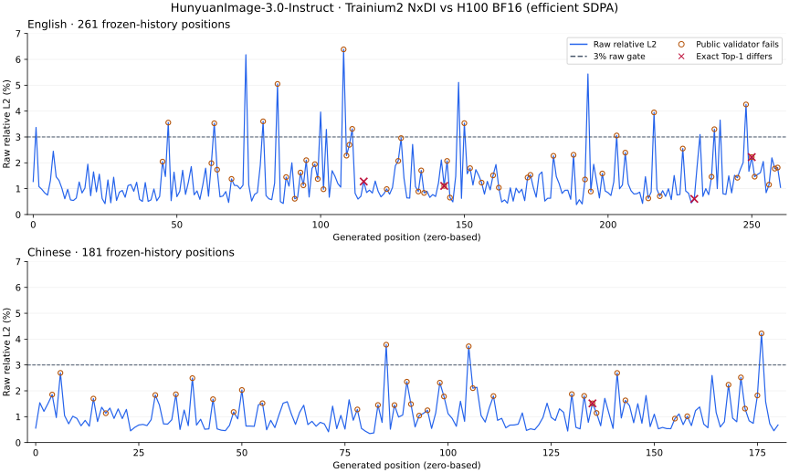

# HunyuanImage-3.0-Instruct on Trainium2: NxDI evaluation

**Evaluation date: October 9, 2026.**

An existing HunyuanImage-3.0-Instruct implementation was restored on one
`trn2.48xlarge`. Its AR → DiT → VAE service completed actual 2-step and 50-step
1024 × 1024 image requests and reproduced the previous Trainium output byte for
byte. AR accuracy against the frozen H100 reference still fails the acceptance
criteria: 22 of 442 positions exceed or equal 3% raw relative L2, and exact
Top-1 agrees at 437 of 442 positions.

**Backend scope:** these measurements come from an external NxDI
(`neuronx-distributed-inference`) application integrated with vLLM-Omni. Public
`vllm-omni-neuron` main at `66973fb0b6a64270ef280bb428a6d7b6c6f2288b` uses the
`torch.compile` / `neuron_native` / `libtorch-neuronx-lite` stack and has no NxDI
integration. See the [runtime architecture](../../design/vllm_omni_neuron_overview.md)
and [declared dependencies](../../../requirements/core.txt).
This document contributes evaluation evidence for model development; it does
not add a Hunyuan pipeline or measure Hunyuan on the public Lite backend.

The organization follows the
[MiniMax-H3 implementation report in upstream PR #1](https://github.com/aws-neuron/vllm-omni-neuron/pull/1),
reviewed at head `275bcc81f43051132e4e139a348fe6f669f237b5`.
The H100 reference used here has a BF16 main compute path. It does not establish
the full FP32 reference or BF16-versus-FP32 error floor used in that report.

| Item | Evaluated configuration |
|---|---|
| Model | `tencent/HunyuanImage-3.0-Instruct` |
| Checkpoint revision | `2ec2c78bee7d4b94157341fba86c4c2c7b1858b2` |
| Hardware | One `trn2.48xlarge`, 64 logical NeuronCores in LNC2 |
| Service integration | vLLM-Omni 0.24 with an external Hunyuan NxDI adapter |
| Numerical workers | PyTorch 2.9.0; `torch-neuronx 2.9.0.2.15.32035+de43f57c` |
| NxDI / NxD | `0.9.0+4bcdc54b.dev` / `0.19.28492+435aae2b` |
| Compiler | `neuronx-cc 2.27.5334.0+f702b353` |
| Compilation state | Original compiled graphs restored; no new compilation |

## What runs where

| Component | Placement | Work performed |
|---|---|---|
| HTTP, Omni control, tokenizer | Host | Input handling, tokenization, stage scheduling, response packaging |
| AR | NeuronCores 32–47 | Full 32-layer recaptioning, prefill, cached decode, LM head, device greedy selection and natural stopping |
| DiT, CFG, scheduler | NeuronCores 0–15 | Noise, schedule, guidance, model forward and latent updates inside the compiled application |
| VAE decoder | NeuronCore 16 | Persistent decoder worker; 15 graph calls in the measured image request |
| Accuracy analysis | CPU | Public metric functions applied to captured logits |

The 50-step request produced 261 AR tokens, passed the complete AR payload to
DiT, completed 50 denoising steps and returned an RGB image. The request audit
verified the stage chain and passed its host numerical-compute checks.

## Parallelism

AR uses attention TP16 and MoE TP16 / EP1. DiT uses TP16, and VAE uses one logical
core. Their allocations are disjoint and total 33 logical cores. Each request
executes AR → DiT → VAE in order.

The evaluated configuration is one request, one 1024 × 1024 image and greedy AR
recaptioning. AR uses a 2048-token prefill bucket and a 4096-token KV cache; the
DiT sequence bucket is 7168. No concurrency or core-count sweep was performed.

## Accuracy

### Reference and acceptance criteria

The frozen reference is the full 32-layer official HF model on H100, with BF16
main computation and the 32 official FP32 router weights preserved. Efficient
SDPA is the primary reference; math SDPA is a secondary comparison and also has
a BF16 main compute path.

There are two fixed prompts: English with 261 generated positions and Chinese
with 181. Each position compares all 133120 raw logits under the same frozen
token history. H100 uses full-prefix forward passes, while Trainium uses padded
prefill and cached decode. Differences in parallelism and execution shape have
not yet been isolated.

The original gate requires **raw relative L2 strictly below 3% at every position
and exact Top-1 equality at every position**. Relative L2 is
`||target - reference||₂ / ||reference||₂`, evaluated in FP64. Cosine is computed
in FP64 from the same saved full-vocabulary tensors.

| Input | H100 reference | Raw relative L2, median / maximum | Minimum cosine | Exact Top-1 matches |
|---|---|---:|---:|---:|
| English, 261 positions | Efficient, primary | 1.0321% / 6.3855% | 0.998114 | 257/261 |
| Chinese, 181 positions | Efficient, primary | 0.9302% / 4.2203% | 0.999199 | 180/181 |
| English, 261 positions | Math, secondary | 1.1761% / 9.4191% | 0.997978 | 259/261 |
| Chinese, 181 positions | Math, secondary | 0.9462% / 4.6631% | 0.999353 | 181/181 |

Against the primary reference, raw L2 fails at 19 English and 3 Chinese
positions. Exact Top-1 differs at 4 English and 1 Chinese positions. High
full-vocabulary cosine does not replace either original acceptance criterion.

### Public accuracy tools actually used

The analysis called the unchanged metric implementations from
[`vllm-project/vllm-neuron`](https://github.com/vllm-project/vllm-neuron/tree/f8abae640a43824c1dc73aed3cf2f67b83bce507/vllm_neuron/accuracy),
commit `f8abae640a43824c1dc73aed3cf2f67b83bce507`:

- `logit_validation` for the public validator's default policy.
- `compare_tensors` for raw relative L2, relative L-infinity and maximum absolute error.
- `visualize_logit_results` for the original interactive analysis plots.

A Hunyuan adapter loaded real captures, checked frozen token histories and
called the validator once per position. This prevents its reference-token
selection from changing the history at subsequent positions. Namespace-package
loading bypassed Neuron platform initialization; the metric source files were
unchanged and analysis ran on CPU. Source hashes and package versions are
recorded in the attached JSON.

| Input | Positions passing `logit_validation` | Failing positions |
|---|---:|---:|
| English | 205/261 | 56 |
| Chinese | 144/181 | 37 |
| Total | **349/442** | **93** |

These are position-level validator results, not an image-quality score or a
count of model test cases. The public policy removes a fitted constant shift,
then checks errors over reference Top-5 / 50 / 1000 / all logits with relative
tolerances 1.1% / 2% / 3% / 5%, absolute tolerance `1e-5`, and a 1-ULP BF16
divergence allowance. It measures different properties from raw L2:

| Primary-reference positions | Public policy passes | Public policy fails |
|---|---:|---:|
| Raw L2 < 3% | 341 | 79 |
| Raw L2 ≥ 3% | 8 | 14 |

`compare_tensors` uses FP32 reductions here. Its raw relative L2 differs from
the original FP64 calculation by at most `7.04e-7` for English and `4.23e-7`
for Chinese; the original gate continues to use FP64.

The following static overview is generated from the attached position CSV.
It shows raw L2, public-policy failures and exact Top-1 differences separately.



| Position, zero-based | Observation | Follow-up |
|---|---|---|
| English 143 | Raw L2 1.1072%; different unique Top-1 winners; public logit gap 0.1875 exceeds the 1-ULP threshold 0.0625; Top-5 also fails | First non-tie divergence to investigate with qualified intermediate captures |
| English 108 | Raw L2 6.3855%, the English maximum; all public Top-K checks fail | Replay the error peak with controlled interventions |
| Chinese 176 | Raw L2 4.2203%, the Chinese maximum; public Top-50 fails | Inspect the late Chinese error peak |
| English 115, 230, 250; Chinese 135 | A maximum-logit tie occurs on at least one side | Keep tie and margin controls; retain the original exact Top-1 failure count |

Full printed output is attached for
[English](assets/hunyuan-image3-trn2-20261009/english-validation.txt) and
[Chinese](assets/hunyuan-image3-trn2-20261009/chinese-validation.txt).
Each block's `frozen_step` is the global position; `Total Tokens: 1` and
`Token 0` refer to that one validator invocation.

### Repeatability and remaining coverage

| Check | Result | Interpretation |
|---|---|---|
| New capture vs previous serving graph | All 442 unique rows have identical hashes | Restores the previous numerical baseline |
| English → Chinese → English replay | Repeated English logits are bitwise equal; 703 positions executed in total | A/B/A repeatability passes |
| 2-step and 50-step images vs previous Trainium output | Byte-identical PNGs | Functional restoration and output repeatability |
| DiT per-step prediction and latent vs qualified reference | Not measured in this round | The original graph does not export complete step predictions |
| VAE from the same latent vs FP32 decoder | Not measured in this round | No decoder PSNR or FP32 L2 claim |
| FP32 / BF16 / Neuron three-way comparison | Not executed | A qualified full-model FP32 reference is still needed |

Image repeatability is a comparison to the previous Trainium service, not an
H100 or FP32 image-accuracy result.

## Performance

Measurements use one `trn2.48xlarge`, AR16 + DiT16 + VAE1, 1024 × 1024,
seed 718, CFG 2.5, flow shift 3.0 and the prompt:

> A red ceramic teapot on a wooden table, soft morning light.

End-to-end times were measured by a client calling the Omni HTTP endpoint
through a port-forwarding connection.

| Request | AR, 261 tokens | DiT stage | DiT stage / steps | VAE | End-to-end |
|---|---:|---:|---:|---:|---:|
| 50 denoising steps | 20.805 s | 71.846 s | 1.437 s/step | 27.461 s | **122.625 s** |
| 2 steps after the post-capture service restart | 21.319 s | 4.660 s | 2.330 s/step | 27.510 s | **56.301 s** |

A 2-step request preceded the 50-step request in the same process. The second
table row comes from the restarted service. These are individual functional
requests, not repeated identical steady-state measurements or P50/P95 results.

DiT stage time divided by denoising steps includes scheduling and final latent
retrieval. The 50-step run made 51 sampler application calls, with the last
call retrieving the latent; `1.437 s/step` is not a pure kernel measurement.
The 50-step client time exceeds the sum of the three stages by 2.513 seconds.

The actual 50-step output:


## Notes and next steps

- The original serving numerical profile and compiled graphs were retained.
  The historical FP32-router-scores candidate was not enabled.
- The evidence covers two AR prompts and image generation for one English
  prompt. Image editing, dynamic resolution, concurrency and broad image-quality
  benchmarks remain unmeasured.
- First qualify a full FP32 reference and intermediate observations for English
  step 143, then investigate English 108 and Chinese 176. Keep tie controls and
  check that instrumentation preserves the original graph's outputs.
- Complete same-trajectory DiT comparisons and same-latent VAE comparisons
  before making end-to-end numerical-accuracy claims.
- For integration into this public plugin, choose between an explicit optional
  NxDI adapter with isolated dependencies and a port to the existing native/Lite
  model path. Either requires implementation work and validation on the selected
  backend. The public setup guide cautions against mixing its environment with
  a standalone `torch-neuronx` installation.
- After correctness work, measure repeated identical full requests and a
  controlled core-count sweep.

## Inspect the evidence

From the repository root, use standard-library Python to recompute the primary
position counts, median/max L2 and the two-policy cross-tabulation:

```bash
python docs/model-dev/reports/assets/hunyuan-image3-trn2-20261009/summarize.py
```

The script reads the attached CSV and needs no model packages or Neuron device.
The published evidence supports inspection of this evaluation; it does not
recreate inference without the external adapter, compiled graphs, raw captures
and reference tensors.

- [Per-position results, CSV](assets/hunyuan-image3-trn2-20261009/position-summary.csv):
  all 442 primary-reference positions, unchanged from the analysis export.
- [Public-tool results, JSON](assets/hunyuan-image3-trn2-20261009/public-tools.json):
  metric outputs, source hashes, versions and policy; host boot identity and
  local visualization paths omitted.
- [AR cosine, reference comparisons, capture hashes and timings](assets/hunyuan-image3-trn2-20261009/results.json):
  selected measurement fields from the saved evidence.
- [Artifact checksums and provenance](assets/hunyuan-image3-trn2-20261009/manifest.json):
  hashes for published attachments and their source artifacts. Raw tensor hashes
  identify the evaluated inputs; the large tensor files are not included.
